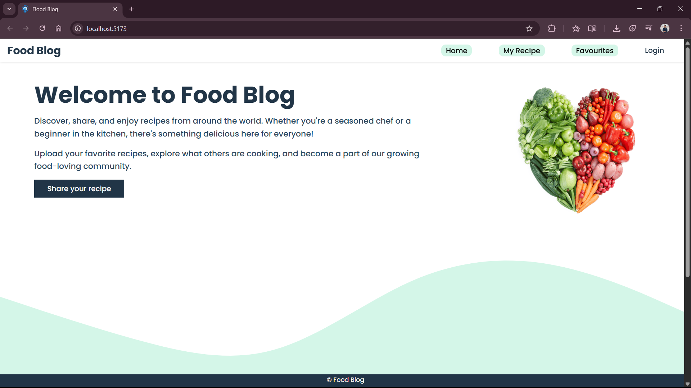
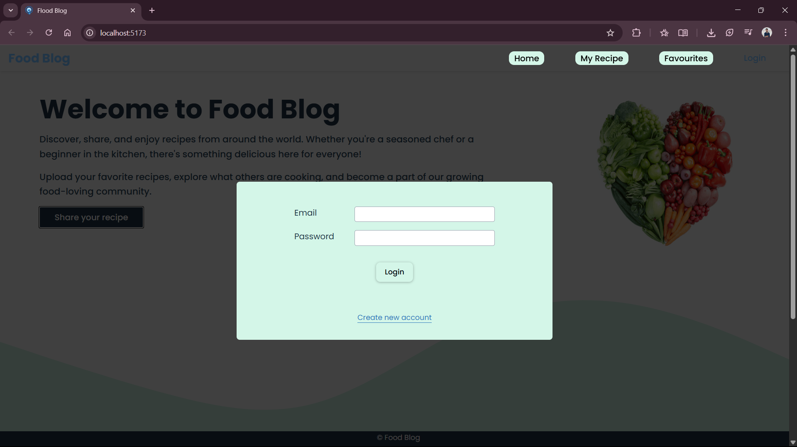

# 🍽️ MERN Food Blog

A full-stack **MERN** (MongoDB, Express, React, Node.js) application where users can explore, share, and manage their favorite recipes. It includes user authentication, authorization, JWT-based login, and personal recipe management features.

🌐 **Live Site**: [https://teal-starlight-b3aa75.netlify.app](https://teal-starlight-b3aa75.netlify.app)

---

## 🚀 Features

* ✅ **User Authentication & Authorization**

  * Register and login using JWT tokens
  * Passwords securely hashed with bcrypt

* 🍔 **Browse All Recipes**

  * Explore a wide range of delicious food items
  * View recipe details and ingredients

* 📝 **Add Your Own Recipes**

  * Authenticated users can create, edit, and delete their own recipes

* ❤️ **Favorite Recipes**

  * Save recipes to your favorites list
  * Quickly access all your favorites in one place

* 👤 **My Recipes**

  * View all recipes added by the logged-in user
  * Manage your personal recipe collection

* 🌐 **RESTful API**

  * Built with Express.js and MongoDB
  * Fully scalable and secure

---

## 🛠️ Tech Stack

**Frontend:**

* React.js (with Vite)
* React Router
* Axios
* CSS (custom styling)

**Backend:**

* Node.js
* Express.js
* MongoDB with Mongoose
* JWT for Authentication
* bcrypt for password hashing
* CORS & dotenv

---

## 🔐 Authentication Flow

1. User registers with email and password.
2. Backend validates and hashes password.
3. JWT token is issued and stored in localStorage.
4. Token is sent with requests to access protected routes like:

   * Adding a recipe
   * Viewing “My Recipes”
   * Saving favorites

---

## 📁 Project Structure

```bash
mern-food-blog/
├── backend/
│   ├── controllers/
│   ├── models/
│   ├── routes/
│   └── index.js
├── frontend/
│   └── food-blog-app/
│       ├── src/
│       │   ├── components/
│       │   ├── pages/
│       │   ├── context/
│       │   └── App.jsx
│       ├── public/
│       ├── vite.config.js
│       └── package.json
├── screenshots/
│   ├── ss1.png
│   └── ss2.png
├── .env
├── package.json
└── README.md
```

---

## 🚀 Getting Started (Locally)

### Prerequisites

* Node.js
* MongoDB
* npm or yarn

### 1. Clone the Repository

```bash
git clone https://github.com/ShivamGupta-16/mern-food-blog.git
cd mern-food-blog
```

### 2. Backend Setup

```bash
cd backend
npm install
```

Create a `.env` file in the backend root and add:

```
MONGO_URI=your_mongodb_connection_string
SECRET_KEY=your_jwt_secret
```

Start the backend:

```bash
npm run start
```

### 3. Frontend Setup

```bash
cd ../frontend/food-blog-app
npm install
npm run dev
```

---

## 📸 Screenshots

> Screenshots are stored in the `/screenshots` folder of the root project directory:

* **Screenshot 1**
  

* **Screenshot 2**
  

---

## 🧠 Future Enhancements

* Comments and reviews on recipes
* Image upload for recipes
* Filter/search by ingredients or category
* Admin dashboard for recipe moderation

---

## 👨‍💼 Author

**Shivam Gupta**

* 📧 Email: [shivamguptavns01@gmail.com](mailto:shivamguptavns01@gmail.com)
* 💻 GitHub: [ShivamGupta-16](https://github.com/ShivamGupta-16)

---

## 📄 License

This project is open-source and available under the [MIT License](LICENSE).

---

⭐️ **If you liked the project, feel free to star it on GitHub!**
